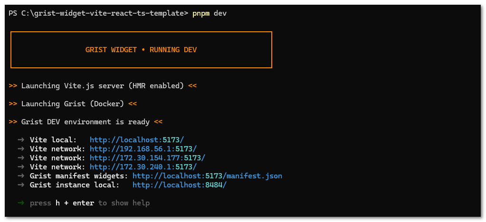
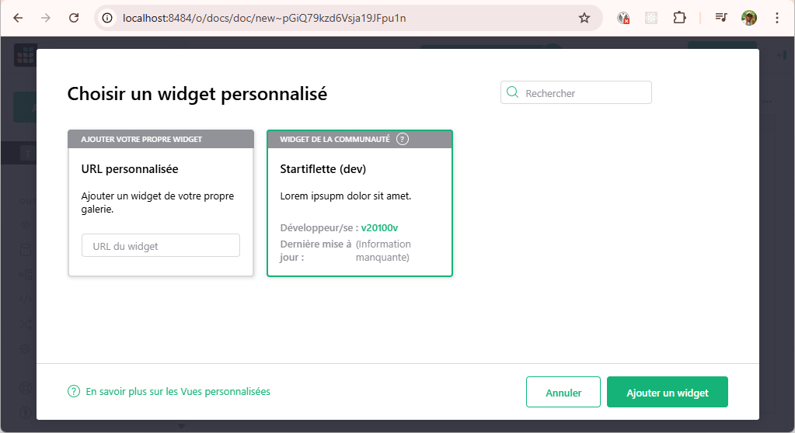
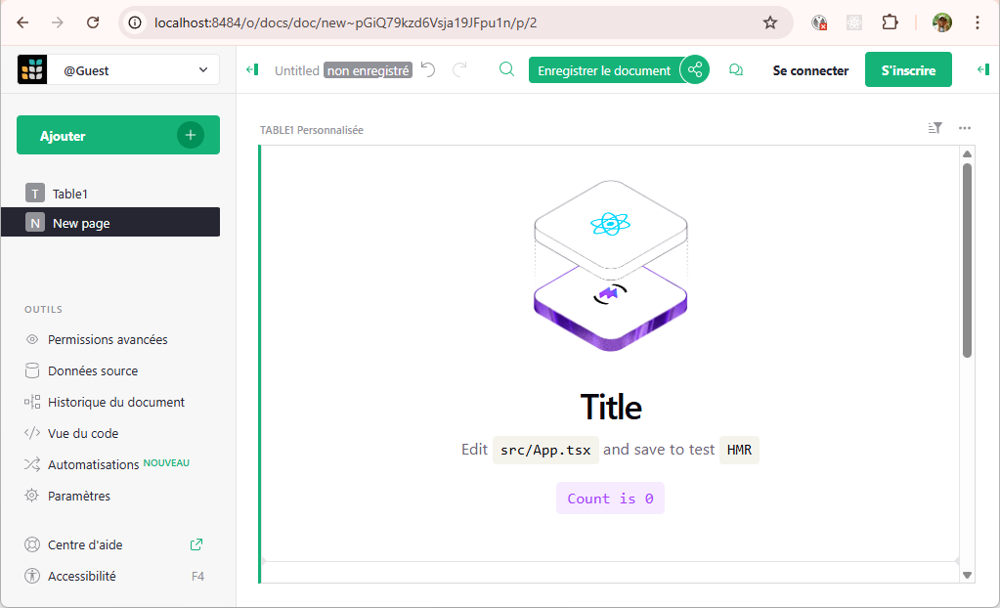

Grist widget Vite React TypeScript template
===========================================
<small>*Français* | [**English**](./README.md)</small>

Boilerplate basé sur Vite avec React et TypeScript pour créer des widgets personnalisés Grist.

---

## Préambule

Ce boilerplate fournit une base solide pour développer des widgets personnalisés Grist. En s'appuyant sur **Vite.js** pour un remplacement de modules à chaud (HMR) quasi instantané et sur **TypeScript** pour une sécurité de typage de bout en bout, il garantit une expérience développeur supérieure. Il inclut également un **environnement Grist dockerisé**, vous permettant de tester vos widgets dans une instance Grist réelle en local, sans aucune configuration manuelle. L'architecture est très flexible : elle gère automatiquement votre manifeste de widget et prend en charge deux stratégies de build (Standard Vite pour un découpage optimisé des assets, ou SPA (application monopage)) selon vos besoins de déploiement.

**Fonctionnalités principales :**
- Fournir un environnement prêt à l'emploi pour les développeurs de widgets personnalisés Grist
- Simplifier le développement local, la compilation et la prévisualisation grâce à des scripts dédiés (`dev`, `build` et `preview`)
- Permettre une personnalisation facile via le champ `grist` dans `package.json`


## Démarrage rapide


### Prérequis

- **[Docker](https://docs.docker.com/get-docker/)** (>= 28.4)
- **[Docker Compose](https://docs.docker.com/compose/install/)** (>= 2.39)
- **[Node.js](https://nodejs.org/en/download/)** (>= 20.20.x)
- **[pnpm](https://pnpm.io/installation)** (>= 10.28.x)


### Développement

1. **Cloner le dépôt**
   ```bash
   git clone https://github.com/6i-software/grist-widget-vite-react-ts-template.git
   ```


2. **Installer les dépendances** à l'aide du gestionnaire de paquets [pnpm](https://pnpm.io/installation) :
   ```bash
   pnpm install
   ```


3. **Configurer votre widget** en modifiant le champ `grist` dans le `package.json` racine. Cela rend le widget disponible dans votre catalogue de widgets personnalisés Grist.
   ```json
   /** ./package.json **/
   {
     "name": "@badi/grist-widget-title",
     "version": "0.0.1",
     "description": "Un widget Grist pour ...",
     // ... //
     "gristWidget": {
       "name": "Widget titre (dev)",
       "url": "http://localhost:5173/index.html",
       "widgetId": "@badi/grist-widget-title",
       "published": true,
       "accessLevel": "none",
       "renderAfterReady": true,
       "description": "Lorem ipsum dolor sit amet.",
       "isGristLabsMaintained": false,
       "authors": [{"name": "v20100v", "url": "https://github.com/v20100v"}]
     }
   }
   ```


4. **Démarrer l'environnement de développement Grist local**
   ```bash
   pnpm dev
   ```
   > **Astuce** : Pour un affichage plus détaillé au démarrage, vous pouvez utiliser le flag `--verbose` ou `-v` dans la commande `pnpm dev --verbose`. Cela est utile pour déboguer l'orchestration des conteneurs ou l'initialisation du serveur.

   Cette commande lance un conteneur Docker Grist <http://localhost:8484> et un serveur de développement Vite <http://localhost:5173>, qui sert également le manifeste des widgets <http://localhost:5173/manifest.json>.

   
   <small>— Lancement de l'environnement de développement du widget personnalisé Grist</small>

   > **Astuce :** Pour séparer les logs Vite et les logs Docker, ouvrez deux terminaux et exécutez :
   > - Terminal 1 : `pnpm grist-up ; pnpm grist-logs`
   > - Terminal 2 : `pnpm vite --debug`


5. **Vérifier la disponibilité du manifeste local**. Assurez-vous que votre widget est correctement exposé en consultant le manifest.json généré dynamiquement sur <http://localhost:5173/manifest.json>.


6. **Utiliser le widget dans Grist local**. Une fois l'environnement de développement lancé, ouvrez l'instance Grist locale sur <http://localhost:8484> afin de créer un nouveau document et d'y ajouter une vue personnalisée.

   
   <small>— Chargement du widget local dans l'instance Grist locale</small>

   > **Note :** Vous remarquerez que le widget local déclaré dans le manifest.json (servi sur `:5173`) est accessible. Il apparaît automatiquement car la variable d'environnement Docker `GRIST_WIDGET_LIST_URL` est configurée pour pointer Grist vers votre manifeste local.


7. Et voilà le widget final ! Grâce au HMR (Hot Module Replacement) fourni par Vite.js, vos modifications de code sont reflétées instantanément sans rechargement complet de la page. Contrairement au Live Reload standard, le HMR ne met à jour que les modules modifiés. Cela préserve l'état actuel et les données de votre widget, garantissant un workflow de développement fluide et ultra-rapide.

   
   <small>— Rendu du widget en temps réel dans Grist avec HMR</small>


### Build

Le processus de build compile votre code source TypeScript et vos assets en un widget prêt pour la production, optimisé pour les performances et la compatibilité. Il s'appuie sur Vite.js pour le bundling des assets et sur le compilateur React pour un rendu optimisé. Les artefacts finaux sont organisés dans le dossier `dist/`, prêts pour le déploiement.

```bash
pnpm build
```

#### Stratégies de build

Cet outil prend en charge deux stratégies architecturales distinctes. Vous pouvez basculer entre elles à l'aide de flags CLI ou de la variable d'environnement `VITE_BUILD_STRATEGY`.

| Stratégie    | Commande                | Description                                                                                                                                                                                              |
|:-------------|:------------------------|:---------------------------------------------------------------------------------------------------------------------------------------------------------------------------------------------------------|
| **Standard** | `pnpm build --standard` | **Par défaut.** Implémente un découpage avancé du code. Les bibliothèques tierces (comme React) sont regroupées dans des chunks `vendor` séparés pour maximiser les hits de cache navigateur et réduire les temps de chargement. |
| **SPA**      | `pnpm build --spa`      | Pour construire une SPA (*Single Page Application*). Utilise `vite-plugin-singlefile` pour intégrer tout le JavaScript et le CSS directement dans un **fichier HTML unique**.                            |

Pour déterminer quelle stratégie utiliser, l'outil `build.js` suit cette hiérarchie :

1. **Flags raccourcis CLI** (ex. `--spa` ou `--standard`)
2. **Arguments CLI explicites** (ex. `--VITE_BUILD_STRATEGY=SPA`)
3. **Variables d'environnement** (via `.env` ou le shell système)
4. **Utilisation du fallback par défaut** (`STANDARD`)

#### Pipeline de build

Lorsque vous déclenchez un build, les événements de cycle de vie suivants se produisent :
- **Génération du manifeste** : Le plugin `generateGristManifestPlugin` extrait votre configuration `grist` de `package.json` pour créer un `manifest.json` Grist standard dans le répertoire public.
- **Sortie versionnée** : Pour éviter les conflits de déploiement, les assets sont placés dans un sous-répertoire selon la version du widget, par exemple `dist/v1.0.0/`.
- **Post-traitement des métadonnées** : Une fois le bundle finalisé, le plugin `updateGristManifestDistPlugin` injecte la version courante et un horodatage ISO `lastUpdatedAt`.


### Preview

Le mode prévisualisation vous permet de tester la version prête pour la production de votre widget (les fichiers compilés dans `/dist`) au sein d'une instance Grist en direct, avant le déploiement.

```bash
pnpm preview
```

Cette commande orchestre quatre étapes clés :

- **Build de production** : Déclenche automatiquement un build en utilisant les variables d'environnement `NODE_ENV: production` et `PREVIEW_MODE: true` pour s'assurer que vos assets sont compilés spécifiquement pour l'environnement de prévisualisation.

- **Serveur de prévisualisation Vite** : Démarre un serveur web local sur le port 4173 (en mode strict) pour servir les fichiers statiques directement depuis le répertoire `dist/v.{x.y.z}/`.

- **Grist dockerisé** : Lance un conteneur Grist préconfiguré pour reconnaître automatiquement le manifeste de production stocké dans `dist/v.{x.y.z}/manifest.json`.

- **Liaison dynamique** : Injecte l'URL du manifeste de production ([http://host.docker.internal:4173/manifest.json](http://host.docker.internal:4173/manifest.json)) dans l'environnement Grist via la variable `GRIST_WIDGET_LIST_URL`, rendant votre widget instantanément disponible dans le catalogue de widgets personnalisés Grist.


## À propos

### Vous souhaitez contribuer ?

Les idées, rapports de bugs, signalements de fautes dans la documentation, commentaires, pull-requests et étoiles GitHub sont toujours les bienvenus !


### Licence

Publié sous [Licence MIT](./LICENSE),<br/>
Copyright (c) 2026 by 2o1oo vb20100bv@gmail.com